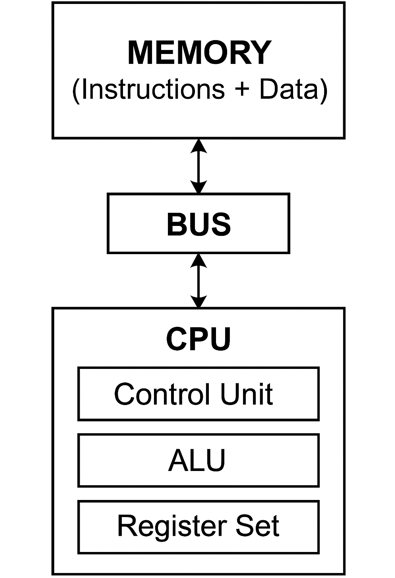

# 1. 마이크로프로세서 개요

## 1.1 마이크로프로세서란 무엇인가?

### 개요

**마이크로프로세서(Microprocessor)**는 컴퓨터 시스템의 **중앙 처리 장치(CPU: Central Processing Unit)** 역할을 수행하는 **단일 집적 회로(Integrated Circuit, IC)**이다.
 이 회로는 연산, 제어, 데이터 처리 기능을 모두 내장하고 있으며, 명령어 집합에 따라 **프로그램된 명령을 순차적으로 실행**하는 디지털 논리 장치다.

> 즉, 마이크로프로세서는 프로그램 명령어를 해석하고 실행하여, 시스템 전체의 동작을 통제하는 핵심 부품이다.

### 핵심 기능

마이크로프로세서가 수행하는 주요 기능은 다음과 같다:

| 기능                  | 설명                                                        |
| --------------------- | ----------------------------------------------------------- |
| **산술 연산**         | 덧셈, 뺄셈, 곱셈, 나눗셈 등의 정수 및 실수 연산 수행        |
| **논리 연산**         | AND, OR, XOR, NOT 등 이진 논리 연산 처리                    |
| **데이터 이동**       | 메모리, 레지스터, 입출력 장치 간의 데이터 전송              |
| **명령어 해석**       | 명령어 인출(fetch) → 해석(decode) → 실행(execute) 단계 수행 |
| **분기 및 제어 흐름** | 조건 분기, 루프 제어 등 프로그램 흐름 결정                  |

### 구성 요소

마이크로프로세서는 일반적으로 다음과 같은 구성요소를 포함한다:

| 구성 요소                        | 설명                                    |
| -------------------------------- | --------------------------------------- |
| **ALU (Arithmetic Logic Unit)**  | 산술 및 논리 연산을 담당하는 연산장치   |
| **레지스터(Register)**           | 내부 데이터 저장 및 연산 임시 저장소    |
| **제어 유닛(Control Unit)**      | 명령어를 해석하고 각 부품의 동작을 제어 |
| **클럭 발생기(Clock Generator)** | 연산 타이밍과 동작 주기를 조절하는 시계 |
| **버스 인터페이스**              | 외부 메모리, 주변장치와 데이터 통신     |

### 간단한 동작 흐름

1. **명령어 인출 (Fetch)**: 메모리로부터 명령어를 가져온다.
2. **명령어 해석 (Decode)**: 명령어의 의미를 분석한다.
3. **명령어 실행 (Execute)**: 해당 명령어를 실행한다.
4. **결과 저장 또는 다음 명령 수행**: 결과를 저장하거나 다음 명령을 수행한다.

### 마이크로프로세서의 예시

| 제품명        | 제조사    | 아키텍처 |
| ------------- | --------- | -------- |
| Intel 8086    | Intel     | x86      |
| ARM Cortex-M0 | ARM       | ARM      |
| RISC-V RV32IM | 오픈소스  | RISC-V   |
| ESP32         | Espressif | Xtensa   |
| Apple M1      | Apple     | ARM64    |

### 마이크로프로세서와 마이크로컨트롤러 비교

| 항목      | 마이크로프로세서 (MPU)    | 마이크로컨트롤러 (MCU)           |
| --------- | ------------------------- | -------------------------------- |
| 구성      | CPU 단일                  | CPU + RAM + ROM + I/O 통합       |
| 용도      | 고성능, 멀티태스킹 시스템 | 임베디드 제어, 센서, 소형 시스템 |
| 외부 회로 | 외부 메모리, I/O 필요     | 대부분 내부에 포함됨             |
| 예        | Intel Core i7, AMD Ryzen  | STM32, ATmega328P                |

### 마이크로프로세서의 응용 분야

- 개인용 컴퓨터(CPU)
- 서버 및 클라우드 인프라
- 산업 자동화 제어기
- 네트워크 라우터 및 스위치
- 스마트폰, 태블릿
- 드론, 로봇, 자율주행 시스템
- AI 가속기와 엣지 컴퓨팅 장치

### 요약

- 마이크로프로세서는 컴퓨터 시스템에서 중심적인 연산 및 제어 역할을 수행하는 **단일 IC 기반 CPU**다.
- ALU, 레지스터, 제어유닛 등으로 구성되며, 명령어를 해석하고 실행하는 구조를 가진다.
- 현대 기술에서는 ARM, RISC-V, x86, Xtensa 등 다양한 아키텍처 기반의 마이크로프로세서가 사용된다.

## 1.2 마이크로프로세서와 마이크로컨트롤러의 차이

### 1. 기본 정의

#### 📌 마이크로프로세서 (Microprocessor Unit, **MPU**)

> **마이크로프로세서**는 **CPU 기능만**을 단일 칩(IC)에 통합한 장치로, 외부 메모리 및 주변장치와 함께 사용되는 고성능 연산 장치다.

- 주로 **일반 목적 연산**(General-purpose computing)에 초점
- 예: Intel x86, AMD Ryzen, ARM Cortex-A 시리즈

#### 📌 마이크로컨트롤러 (Microcontroller Unit, **MCU**)

> **마이크로컨트롤러**는 CPU뿐 아니라 **RAM, ROM(Flash), 타이머, 입출력 포트 등**이 함께 내장된 **임베디드 시스템용 단일 칩**이다.

- **특정 제어 기능**을 수행하는 데 최적화
- 예: Atmel AVR, Microchip PIC, STM32, ESP32

### 2. 구조적 차이

| 항목          | **마이크로프로세서 (MPU)**      | **마이크로컨트롤러 (MCU)**     |
| ------------- | ------------------------------- | ------------------------------ |
| 💡 통합도      | CPU만 포함 (메모리, I/O는 외부) | CPU + RAM + Flash + I/O 통합   |
| 🧠 연산 성능   | 매우 높음 (고속 멀티코어)       | 상대적으로 낮음                |
| 🧰 메모리 구성 | 외부 DRAM, Flash 필요           | 내부 Flash, SRAM 포함          |
| ⏱️ 클럭 속도   | 보통 수 GHz                     | 수 MHz ~ 수백 MHz              |
| 🔌 전력 소비   | 높음                            | 매우 낮음                      |
| 🧾 복잡도      | 고사양 시스템 설계 필요         | 간단한 단일 보드 구현 가능     |
| 🔄 용도        | 범용 컴퓨팅 (PC, 서버 등)       | 제어기, 센서, 로봇 등 임베디드 |

### 3. 기능 비교

| 기능 요소                | MPU                  | MCU                 |
| ------------------------ | -------------------- | ------------------- |
| ALU 및 제어 유닛         | ✅                    | ✅                   |
| 타이머/카운터            | ❌ (외부 필요)        | ✅ (내장)            |
| GPIO (입출력 핀)         | ❌ (추가 I/O 칩 필요) | ✅                   |
| 인터럽트 컨트롤러        | ✅                    | ✅                   |
| ADC/DAC                  | ❌                    | ✅ (많이 포함됨)     |
| UART/SPI/I2C 등 통신     | 보통 외부 장치       | 대부분 내장됨       |
| 보안 기능 (TrustZone 등) | ✅ (고급 보안지원)    | ✅ (간단한 보안기능) |

### 4. 응용 영역 차이

| 분야        | MPU 적용 예시           | MCU 적용 예시            |
| ----------- | ----------------------- | ------------------------ |
| 컴퓨터      | 데스크탑, 노트북 CPU    | X                        |
| 스마트기기  | 스마트폰, 태블릿        | 센서 허브                |
| 산업용 제어 | 산업용 PC               | PLC, 센서 노드           |
| 자동차      | 인포테인먼트 SoC        | ECU, BMS                 |
| 가전제품    | 스마트 TV 메인 프로세서 | 냉장고 제어기            |
| 로봇/드론   | 비전/SLAM 모듈          | 센서 제어, 모터 드라이버 |

### 5. 설계 철학 및 활용 방식

| 구분        | MPU                      | MCU                      |
| ----------- | ------------------------ | ------------------------ |
| 설계 철학   | “컴퓨터를 구성하자”      | “특정 임무를 자동화하자” |
| 특징        | 성능 중심, 범용성 강조   | 실시간 제어, 전력 효율성 |
| 시스템 구성 | 보드 레벨 통합 설계      | 단일 칩 + PCB면 OK       |
| 개발 언어   | 고급 언어 + OS 기반      | C, 어셈블리, RTOS 가능   |
| OS 동작     | 필수 (Linux, Windows 등) | 보통 OS 없음 또는 RTOS   |

### 6. 실제 예시 비교

| 요소 | 예시                                               |
| ---- | -------------------------------------------------- |
| MPU  | Intel Core i9, AMD Ryzen, ARM Cortex-A53, Apple M2 |
| MCU  | STM32F103, ATmega328P, ESP32, NXP LPC1768          |

### 7. 간단한 외형 비교

| 항목 | 이미지 예시                      |
| ---- | -------------------------------- |
| MPU  | 데스크탑 CPU, 라즈베리파이 SoC   |
| MCU  | Arduino Uno, STM32 보드, ESP8266 |

> 참고: MCU는 칩 하나로도 시스템이 구성되지만, MPU는 주변장치와 함께 메인보드 수준으로 설계되어야 한다.

### 요약 정리

- **MPU**는 고성능 컴퓨팅을 위한 **중앙처리 전용 칩**이며, 복잡한 외부 하드웨어와 함께 작동한다.
- **MCU**는 특정 작업을 위한 **내장형 올인원 제어 칩**으로, 임베디드 제어에 적합하다.
- 둘은 처리 성능, 구성 방식, 전력 소모, 적용 분야에서 **근본적으로 다른 설계 목표**를 지닌다.

## 1.3 CPU, MPU, MCU, DSP의 개념 비교

### 🧩 용어 정의

| 용어    | 정식 명칭                | 정의                                                         |
| ------- | ------------------------ | ------------------------------------------------------------ |
| **CPU** | Central Processing Unit  | 모든 계산과 명령 제어를 수행하는 **컴퓨터의 두뇌** 역할을 하는 장치 |
| **MPU** | Microprocessor Unit      | CPU만을 단일 칩에 집적한 것으로, **일반 연산에 특화된 고성능 프로세서** |
| **MCU** | Microcontroller Unit     | CPU + 메모리 + 입출력 장치를 **하나의 칩에 통합한 제어용 시스템** |
| **DSP** | Digital Signal Processor | **디지털 신호 처리(필터링, FFT, 오디오 등)**에 특화된 프로세서 |

### 💡 상호 관계

- **CPU**는 기능적인 개념. 나머지는 **물리적 구현 또는 특수화된 형태**이다.
  - MPU = CPU + 외부 회로로 구성하는 일반 시스템
  - MCU = CPU + 주변 기능(ROM, RAM, I/O 등) 내장
  - DSP = CPU 구조를 **신호처리에 최적화**시킨 전용 프로세서

### 📊 기능 및 특징 비교

| 항목        | CPU                    | MPU                     | MCU                     | DSP                           |
| ----------- | ---------------------- | ----------------------- | ----------------------- | ----------------------------- |
| 기본 정의   | 명령 처리 장치         | CPU 기능을 가진 단일 칩 | 임베디드 제어용 통합 칩 | 디지털 신호 처리 전용 칩      |
| 구성        | 연산 + 제어 유닛       | CPU 단독                | CPU + RAM + ROM + I/O   | CPU + MAC + FFT + 특수 연산기 |
| 메모리      | 없음 (추상 개념)       | 외부 메모리 필요        | 내장 RAM/ROM            | 보통 내장, 일부 외부          |
| 입출력      | 없음                   | 외부 회로               | GPIO 등 직접 포함       | A/D, D/A, 고속 버스 포함      |
| 동작 속도   | 개념적                 | 수백 MHz ~ GHz          | 수 MHz ~ 수백 MHz       | 수백 MHz 이상                 |
| 전력 소모   | -                      | 높음                    | 매우 낮음               | 보통 낮음 (전용 설계)         |
| 실시간 제어 | 제한적                 | 어려움                  | 가능                    | 가능 (딜레이 최소화 설계)     |
| 신호 처리   | 가능하지만 비효율      | 비효율                  | 거의 불가능             | 최적화됨                      |
| OS 필요     | 필요 (CPU 자체는 아님) | 거의 항상 필요          | 대부분 없음             | 전용 코드 실행                |
| 병렬 처리   | 제한적 (멀티코어 가능) | 멀티코어 구조 많음      | 단일 스레드 중심        | 다중 버스, 병렬 연산 최적화   |

### 🧠 용도 및 응용 차이

| 분류    | 주요 용도               | 예시 제품              | 적용 예                      |
| ------- | ----------------------- | ---------------------- | ---------------------------- |
| **CPU** | 연산·제어 핵심          | x86, ARM Core          | 모든 컴퓨팅 장치             |
| **MPU** | 범용 처리               | Intel i7, ARM Cortex-A | PC, 스마트폰, 라즈베리파이   |
| **MCU** | 센서/제어 임무          | STM32, ATmega328       | 드론, 가전, 자동차 ECU       |
| **DSP** | 오디오/이미지/센서 신호 | TI C6000, AD SHARC     | 음성 인식, 레이더, EEG, 모뎀 |

### 🛠️ 기술적 차이: 구조 비교

| 구성 요소     | MPU         | MCU         | DSP                                      |
| ------------- | ----------- | ----------- | ---------------------------------------- |
| ALU           | 일반 연산용 | 제어에 적합 | **MAC(Multiply-Accumulate) 연산기** 포함 |
| 버스 구조     | 외부 중심   | 온칩 버스   | 고속 병렬 버스                           |
| 파이프라인    | 일반적      | 단순        | **딥 파이프라인** 설계                   |
| 인터럽트 처리 | OS 중심     | 빠름        | 매우 빠름 (우선순위 높음)                |
| 하드웨어 가속 | X           | 제한적      | **FFT, FIR 필터, PID** 등 내장           |

### 🧪 실무에서의 선택 기준

| 상황                        | 적합한 선택                   |
| --------------------------- | ----------------------------- |
| 고성능 컴퓨터 연산          | **MPU** (x86, ARM Cortex-A)   |
| 센서 기반 로봇 제어         | **MCU** (STM32, AVR)          |
| 실시간 오디오 필터링        | **DSP** (TI, Analog Devices)  |
| 단순 논리 제어              | **MCU** (8비트, 16비트)       |
| 자율주행 AI + 카메라 + 제어 | **MPU + MCU + DSP** 복합 설계 |

### 💬 비유로 이해하기

| 비유    | 역할                                           |
| ------- | ---------------------------------------------- |
| **CPU** | 두뇌의 개념 자체 (기능적)                      |
| **MPU** | 고급 두뇌만 탑재한 전문가 (연산 특화)          |
| **MCU** | 두뇌 + 손발을 가진 공장 자동화 로봇            |
| **DSP** | 귀와 뇌가 연결된 **청각 전문가** (실시간 분석) |

### 📌 요약 정리

- **CPU**는 논리적 처리의 중심 개념으로, MPU/MCU/DSP 모두 이 기능을 포함한다.
- **MPU**는 범용 연산을 위한 CPU 단일 칩이며, 고성능 외부 시스템을 요구한다.
- **MCU**는 단일 칩에 모든 기능이 포함된 소형 제어 시스템으로, 임베디드 및 저전력 제어에 적합하다.
- **DSP**는 고속 신호 처리에 최적화된 구조를 가진 프로세서로, 반복적 수학 연산에 강하다.

## 1.4 마이크로프로세서의 역사 (Intel 4004 → 최신 ARM)

### 🧭 개요

마이크로프로세서의 역사는 **1971년 Intel 4004**의 출현과 함께 시작되었다. 이후 반도체 집적 기술, 전력 효율, 아키텍처 설계의 혁신을 거쳐, 오늘날에는 **ARM 기반 모바일 SoC**와 **x86 기반 고성능 컴퓨팅**이 대표적인 축으로 나뉘어 발전했다.

### 📅 주요 발전 연대기

| 연도      | 프로세서                | 설명                                                         |
| --------- | ----------------------- | ------------------------------------------------------------ |
| **1971**  | **Intel 4004**          | 세계 최초의 상용 마이크로프로세서 (4비트, 740kHz, 2,300 트랜지스터) |
| **1974**  | **Intel 8080**          | 8비트 MPU. Altair 8800 PC에 사용되며 개인용 컴퓨터 시대 개막 |
| **1978**  | **Intel 8086**          | 16비트 x86 아키텍처의 시작, 이후 IBM PC에 채택됨             |
| **1981**  | **Motorola 68000**      | 32비트 내부 구조, 애플 매킨토시 및 Atari ST에 사용           |
| **1982**  | **Intel 80286**         | 보호 모드 도입, 멀티태스킹 가능. IBM PC/AT 사용              |
| **1985**  | **Intel 80386**         | 최초의 완전한 32비트 프로세서, 가상 메모리/페이징 도입       |
| **1989**  | **Intel 80486**         | 파이프라이닝 도입, FPU 통합, 캐시 내장                       |
| **1993**  | **Intel Pentium**       | 슈퍼스칼라 구조 도입. 성능 도약. x86 대중화                  |
| **1996**  | **ARM7TDMI**            | 저전력 32비트 MCU 아키텍처, 휴대기기 확산의 초석             |
| **2000s** | **Intel Core 시리즈**   | 멀티코어 아키텍처 진입 (Core Duo, Core i7 등)                |
| **2011**  | **ARM Cortex-A 시리즈** | 스마트폰/태블릿 중심의 고성능 모바일 SoC 구조 정립           |
| **2020**  | **Apple M1**            | ARM 기반 최초 데스크탑용 SoC, 고성능+저전력 혁신             |
| **2023+** | **RISC-V 확산**         | 오픈 아키텍처의 부상, AI/엣지/교육 분야 확장 중              |

### 🧬 아키텍처별 발전사

#### ✅ Intel x86 아키텍처

- x86 → i386 → Pentium → Core 시리즈 → Core i9 / Xeon
- IBM 호환 PC의 표준 아키텍처로 성장
- 강력한 소프트웨어 호환성 확보 (Windows, Linux)

#### ✅ ARM 아키텍처

- ARM1 (Acorn RISC Machine) → ARM7 → Cortex-M/A/R → Apple M 시리즈
- 저전력 + 고효율 설계로 모바일 시장 장악
- 라이선스 모델을 통한 생태계 확장

#### ✅ MIPS / SPARC / PowerPC

- 고성능 워크스테이션 중심에서 출발했으나 점차 ARM과 x86에 밀림
- PowerPC는 애플 초기 Mac에 사용되었으나 Intel로 전환됨

#### ✅ RISC-V (신흥 아키텍처)

- 완전한 오픈소스 ISA
- 유연한 확장성 + 무료 라이선스
- MCU, AI 엣지칩, 연구용으로 급부상

### 📊 주요 기술적 도약

| 기술                      | 시대   | 설명                                 |
| ------------------------- | ------ | ------------------------------------ |
| **파이프라이닝**          | 1980s  | 명령어 처리 병렬화                   |
| **슈퍼스칼라 구조**       | 1990s  | 한 클럭에 다중 명령 실행             |
| **멀티코어**              | 2000s  | 병렬 연산 효율 극대화                |
| **캐시 계층 확대**        | 1990s~ | L1~L3 캐시로 메모리 병목 완화        |
| **Out-of-order 실행**     | 1990s~ | 명령 재정렬로 파이프라인 활용 극대화 |
| **Speculative Execution** | 2000s~ | 분기 예측 기반 사전 실행             |
| **ARM big.LITTLE 구조**   | 2010s  | 고성능+저전력 코어 혼합              |
| **SoC 통합화**            | 2010s~ | GPU, NPU, RAM 컨트롤러 등 온칩 집적  |

### 🔬 트랜지스터 수 변화

| 프로세서         | 트랜지스터 수 |
| ---------------- | ------------- |
| Intel 4004       | 2,300         |
| Intel 80386      | 275,000       |
| Intel Pentium    | 3,100,000     |
| Core i9 (13세대) | 10~20억 이상  |
| Apple M1         | 약 160억      |
| Apple M2 Ultra   | 1340억 이상   |

### 📱 최근 트렌드

- **AI 연산 통합** (NPU, TPU 등)
- **보안 기능 강화** (TrustZone, SGX)
- **RISC-V 및 오픈 아키텍처의 성장**
- **엣지 컴퓨팅 중심의 초저전력 설계**
- **칩렛 기반 모듈형 아키텍처 확산**

### 🧠 요약 정리

- 마이크로프로세서의 역사는 **Intel 4004의 탄생**을 기점으로 시작되었으며, 이후 **x86 아키텍처의 상용화**, **ARM의 저전력 생태계**, 그리고 **RISC-V의 오픈 혁신**으로 발전해왔다.
- 초기에는 단순한 계산기 수준이었지만, 현재는 **멀티코어 고성능 AI 가속기** 수준의 고도로 통합된 SoC 구조로 진화했다.
- 미래는 **모듈화, 보안성, AI 연산 특화, 그리고 오픈 아키텍처 기반 생태계**의 경쟁으로 나아가고 있다.

## 1.5 RISC vs CISC 구조

### 🧠 기본 정의

#### ✅ RISC (Reduced Instruction Set Computer)

> **단순하고 제한된 수의 명령어**로 구성된 아키텍처.
>  각 명령어가 **하나의 클럭 주기 내에서 실행**되도록 설계됨.

- 목적: **명령어 단순화** → **빠른 처리 속도**
- 예: ARM, RISC-V, MIPS, SPARC

#### ✅ CISC (Complex Instruction Set Computer)

> **복잡하고 다양한 기능의 명령어**를 제공하는 아키텍처.
>  한 개의 명령어로 **여러 작업을 한 번에 처리**할 수 있음.

- 목적: **코드 밀도 증가** → **메모리 절약**
- 예: x86, x86-64 (Intel, AMD)

### 🔧 설계 철학 차이

| 항목            | **RISC**                  | **CISC**                  |
| --------------- | ------------------------- | ------------------------- |
| 설계 철학       | 단순한 명령어, 빠른 실행  | 복잡한 명령어, 기능 집약  |
| 명령어 수       | 적음 (수십 개 수준)       | 많음 (수백 개 이상)       |
| 명령어 길이     | 고정 길이 (보통 32비트)   | 가변 길이 (1~15바이트 등) |
| 명령어 실행     | 대부분 한 클럭 사이클     | 여러 클럭 사이클          |
| 제어 방식       | 하드와이어드 제어         | 마이크로코드 기반 제어    |
| 컴파일러 최적화 | 컴파일러가 더 많은 제어권 | 하드웨어가 많은 제어 수행 |
| 파이프라인화    | 매우 쉬움                 | 어렵고 복잡함             |

### 🔩 구조 비교

| 요소           | RISC                   | CISC                          |
| -------------- | ---------------------- | ----------------------------- |
| ALU            | 단순 연산 중심         | 복합 연산 내장                |
| 레지스터 수    | 많음 (32~128개)        | 적음 (8~16개 수준)            |
| 메모리 접근    | Load/Store 방식만 허용 | 연산 중 메모리 직접 접근 가능 |
| 주소 지정 방식 | 적음 (3~5가지)         | 다양함 (10가지 이상)          |
| 디코딩 복잡도  | 간단                   | 복잡                          |
| 명령어 번역기  | 없음                   | 마이크로코드 해석기 포함      |

### 📊 성능 비교

| 비교 기준     | RISC                  | CISC                         |
| ------------- | --------------------- | ---------------------------- |
| ⏱️ 속도        | 빠른 실행 (고속 클럭) | 느릴 수 있음 (복잡한 디코딩) |
| 🧠 설계 난이도 | 단순 구조로 쉬움      | 복잡한 구조                  |
| 🔌 전력 소비   | 낮음                  | 상대적으로 높음              |
| 📦 코드 크기   | 상대적으로 큼         | 명령어당 기능이 많아 작음    |
| 📈 성능 최적화 | 컴파일러에 유리       | 하드웨어 중심                |
| 🧪 파이프라인  | 구현 용이             | 해저드 처리 복잡             |

### 🎯 예시 비교 (Load + Add 연산)

#### ✅ RISC 방식:

```
LOAD R1, 0(R2)    ; R1 ← MEM[R2]
LOAD R3, 4(R2)    ; R3 ← MEM[R2+4]
ADD  R4, R1, R3   ; R4 ← R1 + R3
```

#### ✅ CISC 방식:

```
ADD R4, 0(R2), 4(R2) ; R4 ← MEM[R2] + MEM[R2+4]
```

→ **RISC는 단순하지만 명확하고 파이프라이닝에 유리**
 → **CISC는 한 줄로 끝내지만 내부적으로 마이크로명령어로 분해됨**

### 💬 실제 CPU 예시

| 아키텍처          | 종류 | 설명                       |
| ----------------- | ---- | -------------------------- |
| **ARM Cortex**    | RISC | 모바일/IoT용 고효율 저전력 |
| **RISC-V**        | RISC | 오픈소스, 고유 확장 가능   |
| **MIPS**          | RISC | 라우터, 임베디드 시스템    |
| **Intel x86/x64** | CISC | 데스크탑, 서버의 중심      |
| **AMD Ryzen**     | CISC | 고성능 멀티코어 처리       |

> 대부분의 최신 CISC CPU도 **내부적으로는 RISC 유사 마이크로명령어로 변환** 후 처리함
>  (즉, 내부는 RISC + 외부 인터페이스는 CISC 형태로 융합)

### 🔄 하이브리드 구조: 현대 CPU의 방향성

| 현대 아키텍처           | 특징                                       |
| ----------------------- | ------------------------------------------ |
| **Intel Core 시리즈**   | 외부 CISC → 내부 RISC 마이크로코드         |
| **Apple M1/M2**         | ARM 기반 고성능 RISC 아키텍처              |
| **Qualcomm Snapdragon** | ARM 기반 RISC SoC                          |
| **AMD Zen**             | CISC 기반이지만 내부 마이크로-Op 형태 사용 |

### 📌 요약 정리

- **RISC**는 단순한 명령어와 많은 레지스터를 통해 **고속 실행과 파이프라인 효율**을 극대화.
- **CISC**는 복잡한 명령어를 통해 **코드 밀도와 기능 집중도**를 높이며 **메모리 절약**에 유리.
- 현대 CPU는 두 방식을 **융합하거나 내부적으로 변환**하여 최적의 성능을 끌어내는 구조를 취한다.

## 1.6 Von Neumann vs Harvard 아키텍처

### 🧠 기본 정의

#### ✅ Von Neumann Architecture (폰 노이만 구조)

> 명령어(instruction)와 데이터(data)를 **하나의 메모리 공간**에 저장하고, **하나의 버스**로 접근하는 구조

- 특징: 프로그램과 데이터를 **동일한 주소 공간**에서 공유
- 예: 대부분의 **범용 컴퓨터(CPU)**에서 사용

#### ✅ Harvard Architecture (하버드 구조)

> 명령어와 데이터를 **분리된 메모리 공간과 버스**를 통해 각각 독립적으로 처리하는 구조

- 특징: **명령어 메모리와 데이터 메모리**가 물리적으로 분리됨
- 예: **DSP**, **MCU** 및 **고속 제어 시스템**에서 흔히 사용

### 🧩 구조 비교 다이어그램

#### 📚 Von Neumann 구조

```
              +----------------------------+
              |        MEMORY              |
              |  (Instructions + Data)     |
              +----------------------------+
                          ▲
                          │
                   [공용 메모리 접근]
                          │
              +----------------------------+
              |            BUS             |  ← 주소 / 데이터 / 제어 신호 공유
              +----------------------------+
                          ▲
                          │
              +----------------------------+
              |            CPU             |
              |  +----------------------+  |
              |  |    Control Unit      |  | ← 명령어 해석
              |  +----------------------+  |
              |  |        ALU           |  | ← 산술/논리 연산
              |  +----------------------+  |
              |  |     Register Set     |  | ← 연산 중간값 저장
              |  +----------------------+  |
              +----------------------------+

```

#### 🔀 Harvard 구조

```
+----------------+     +----------------+
| Instruction Mem|     |   Data Mem     |
+----------------+     +----------------+
        ↑                     ↑
        | Instruction Bus     | Data Bus
        ↓                     ↓
     +-------------------------------+
     |              CPU              |
     |  +---------+   +-----------+  |
     |  | Control |   | ALU + Reg |  | ← ALU는 Data Bus를 통해 메모리와 직접 연결
     |  +---------+   +-----------+  |
     +-------------------------------+

```

### 🧪 주요 비교표

| 항목        | **Von Neumann**          | **Harvard**              |
| ----------- | ------------------------ | ------------------------ |
| 메모리 구조 | 명령어/데이터 통합       | 명령어/데이터 분리       |
| 버스        | 단일 버스                | 이중 버스                |
| 처리 방식   | 순차적 접근              | 병렬 접근 가능           |
| 동시 접근   | 불가                     | 가능                     |
| 구현 비용   | 저렴하고 단순            | 복잡하고 고비용          |
| 속도        | 메모리 병목 발생 가능    | 병목 줄고 고속 처리 가능 |
| 응용        | 일반 컴퓨터, x86, RISC-V | MCU, DSP, 고속 제어 회로 |

### ⏱️ 성능 관점: 폰 노이만 병목 (Von Neumann Bottleneck)

폰 노이만 구조의 가장 큰 한계는 **병목 현상(Bottleneck)**이다.
 이는 CPU가 하나의 버스로 명령어와 데이터를 **동시에 처리할 수 없기 때문**에 발생하는 속도 저하 문제를 말한다.

- 예시: 명령어 Fetch 중엔 데이터 Read/Write가 대기해야 함

→ 따라서 고속 처리에는 불리함

### 🧰 하버드 구조의 장점

- 병렬 명령어/데이터 접근 가능
- **파이프라인 처리에 최적화**
- 고속 DSP 연산에 매우 유리
- 데이터 버스 폭과 명령어 버스 폭을 **독립적으로 최적화 가능**

> 하버드 구조는 실시간 제어, 오디오/비디오 처리 등 **속도가 중요한 분야**에서 자주 쓰임

### 🧪 하이브리드 구조: Modified Harvard

현대 프로세서들은 순수한 두 구조보다는 **하이브리드 구조**를 많이 채택함.

| 구조             | 설명                                                         |
| ---------------- | ------------------------------------------------------------ |
| Modified Harvard | 내부적으로 명령어/데이터 분리, 외부에서는 통합 메모리        |
| Split L1 Cache   | 명령어 캐시(I-Cache)와 데이터 캐시(D-Cache)를 분리하여 병렬성 확보 |
| 예시             | ARM Cortex-M, 대부분의 ARM Cortex-A, 현대 x86 CPU            |

### 📱 실제 적용 사례

| 구조             | 사용 예시                             |
| ---------------- | ------------------------------------- |
| Von Neumann      | x86, 대부분의 범용 CPU, Raspberry Pi  |
| Harvard          | STM32, AVR, PIC, DSP, TI C6000        |
| Modified Harvard | ARM Cortex-M, RISC-V with split cache |

### 💬 비유로 이해하기

| 구조        | 비유                                                         |
| ----------- | ------------------------------------------------------------ |
| Von Neumann | **하나의 출입문**을 가진 사무실 (사람이 들어오면 물건은 대기해야 함) |
| Harvard     | **두 개의 출입문**을 가진 사무실 (사람과 물건이 동시에 출입 가능) |

### 📌 요약 정리

- **Von Neumann 구조**는 명령어와 데이터를 하나의 메모리 공간과 버스로 공유하는 구조로, 단순하고 범용적이지만 **병목 현상**이 발생할 수 있음.
- **Harvard 구조**는 명령어와 데이터를 분리하여 **병렬 처리와 고속 연산에 유리**하지만 설계가 복잡함.
- 현대 CPU는 보통 **하이브리드 구조**를 채택하여 두 구조의 장점을 통합하려는 방향으로 발전 중이다.

## 1.7 SOC(System on Chip) 개요

### 🧠 기본 개념

**System on Chip (SoC)**는 하나의 실리콘 칩 위에 **CPU, 메모리, 입출력 포트, GPU, 통신 모듈, 주변장치 컨트롤러 등 전체 시스템을 구성하는 모든 회로를 통합**한 형태의 집적 회로(Integrated Circuit)다.

> 다시 말해, SoC는 "컴퓨터 한 대 전체"를 하나의 칩으로 축소시킨 것이다.



### 🔩 구성 요소

SoC는 일반적으로 다음과 같은 구성 요소를 내장하고 있어:

| 구성 요소                           | 역할                                    |
| ----------------------------------- | --------------------------------------- |
| **CPU Core**                        | 명령어 해석 및 처리                     |
| **GPU**                             | 그래픽 처리 또는 병렬 연산              |
| **RAM Controller**                  | 외부 DRAM과 통신                        |
| **Flash Controller**                | 부팅 코드나 설정 저장용 비휘발성 메모리 |
| **I/O 인터페이스**                  | USB, UART, SPI, I2C, GPIO 등            |
| **통신 모듈**                       | Wi-Fi, Bluetooth, LTE, 5G 등            |
| **전력 관리 회로 (PMU)**            | 전압 변환, 전력 절약 기능               |
| **디지털 시그널 프로세서 (DSP)**    | 오디오, 영상 신호 처리                  |
| **NPU/TPU**                         | AI 연산 가속기 (신경망 연산용)          |
| **보안 모듈 (eFuse, TrustZone 등)** | 암호화, 인증 키 저장, 신뢰 부팅 등      |

### 🧬 SoC vs 전통적 CPU 시스템

| 항목      | 전통적 시스템               | SoC 시스템                           |
| --------- | --------------------------- | ------------------------------------ |
| 구성      | CPU + 별도 RAM, GPU, I/O 칩 | 모든 구성요소가 하나의 칩에 통합됨   |
| 크기      | 크고 복잡한 PCB 필요        | 작고 단순한 회로                     |
| 전력 소모 | 높음                        | 매우 낮음                            |
| 성능 확장 | 부품 간 병목 존재           | 통합 버스 및 고속 통신 구조          |
| 응용 분야 | 데스크탑, 서버              | 모바일, IoT, 로봇, 드론, 가전제품 등 |

### ⚙️ SoC 내부 블록 다이어그램 예시

```
        +-----------------------------+
        |          SoC Chip          |
        | +----------+ +-----------+ |
        | |   CPU    | |    GPU    | |
        | +----------+ +-----------+ |
        | +------------------------+ |
        | |   RAM / Flash Ctrl     | |
        | +------------------------+ |
        | +------------------------+ |
        | |    I/O Interfaces      | |
        | | (UART, SPI, I2C, GPIO) | |
        | +------------------------+ |
        | +------------------------+ |
        | | Wi-Fi / BT / LTE Modem | |
        | +------------------------+ |
        | +------------------------+ |
        | | Power Management Unit  | |
        | +------------------------+ |
        | +------------------------+ |
        | | Security / Boot Logic  | |
        | +------------------------+ |
        +-----------------------------+
```

### 📱 대표적 SoC 제품 예시

| SoC 이름             | 제조사         | 주요 사용처              |
| -------------------- | -------------- | ------------------------ |
| Apple M1 / M2        | Apple          | 맥북, 아이패드           |
| Qualcomm Snapdragon  | Qualcomm       | 스마트폰, 태블릿         |
| Samsung Exynos       | 삼성전자       | 스마트폰, AI Edge        |
| Broadcom BCM2711     | Raspberry Pi 4 | 임베디드 시스템, 교육    |
| NVIDIA Orin / Xavier | NVIDIA         | 자율주행, 로봇           |
| ESP32                | Espressif      | IoT, 센서 네트워크       |
| Rockchip RK3399      | Rockchip       | 안드로이드 박스, 미니 PC |

### 🚀 SoC의 장점과 한계

| 장점                                    | 한계                            |
| --------------------------------------- | ------------------------------- |
| 소형화, 경량화                          | 내부 확장성 부족                |
| 저전력, 모바일 최적화                   | 고성능 연산에는 제약            |
| 통합 설계로 부품 비용 절감              | 모든 기능이 고장나면 전체 교체  |
| 최적화된 패키징으로 발열 및 전력 효율 ↑ | 내부 구성 커스터마이징이 어려움 |

### 📌 요약 정리

- **SoC**는 CPU, GPU, 메모리, 통신 모듈, I/O 등을 **하나의 칩에 통합한 시스템 전체**다.
- 저전력, 고집적, 소형화된 구조 덕분에 **모바일 기기, IoT, 드론, 로봇, 자동차** 등에 매우 적합하다.
- 현대 시스템 설계의 핵심 트렌드는 "SoC 중심의 시스템 통합화"이며, 오픈소스 하드웨어(RISC-V 기반 SoC 등)도 급속히 확산되고 있다.